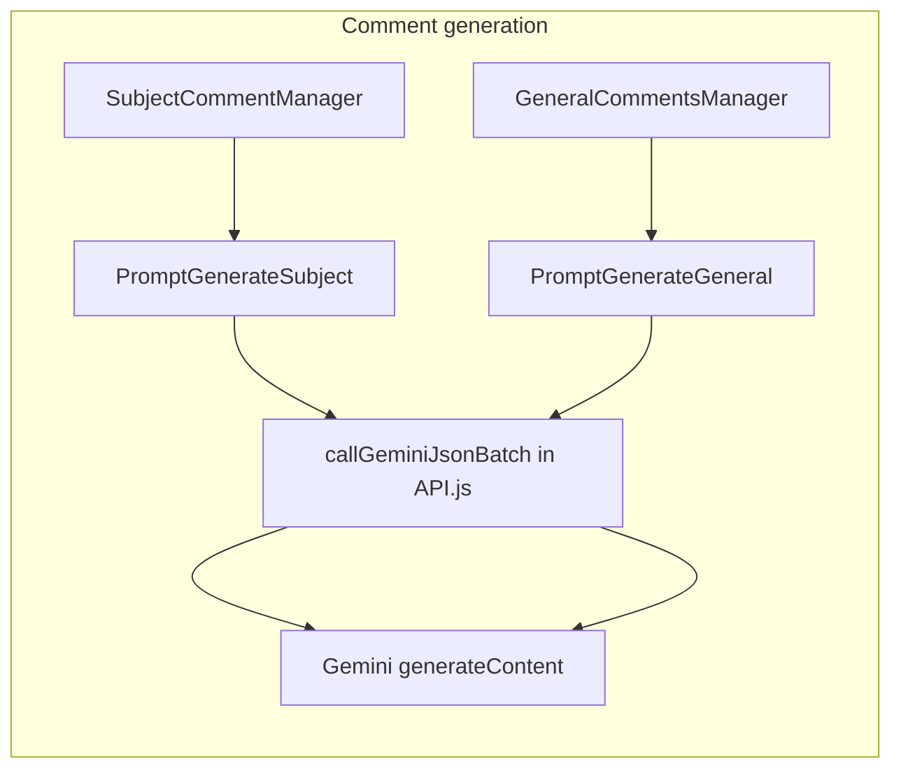

# Gemini generation prompts: peer-tutoring ban and Ghana-simple tone

## How prompts reach Gemini

- [API.js](c:\googlesheets\API.js) builds `payload.contents[0].parts[0].text` from whatever string your `promptFn` returns. There is **no** `systemInstruction` field; the entire instruction is the prompt string.
- Subject batch generation: [SubjectCommentManager.js](c:\googlesheets\SubjectCommentManager.js) calls `PromptGenerateSubject.getCommentGenerationPrompt(...)`.
- General comment generation: [GeneralCommentsManager.js](c:\googlesheets\GeneralCommentsManager.js) calls `PromptGenerateGeneral.getGeneralCommentPrompt(...)`.




## Files that contain **generation** prompts (in scope)


| File                                                                 | Symbol                                             | Role                                 |
| -------------------------------------------------------------------- | -------------------------------------------------- | ------------------------------------ |
| [PromptGenerateSubject.js](c:\googlesheets\PromptGenerateSubject.js) | `PromptGenerateSubject.getCommentGenerationPrompt` | Subject/practical comment JSON batch |
| [PromptGenerateGeneral.js](c:\googlesheets\PromptGenerateGeneral.js) | `PromptGenerateGeneral.getGeneralCommentPrompt`    | Class teacher general comment JSON   |


## Related Gemini prompts (not initial “generation”, but same API path)

These are **post-processing** / QA, not first-pass comment drafting. Include them only if you want end-to-end consistency (polish not adding flowery text; audit flagging peer-tutoring suggestions):


| File                                                         | Symbol                  | Used by                                                        |
| ------------------------------------------------------------ | ----------------------- | -------------------------------------------------------------- |
| [PromptPolish.js](c:\googlesheets\PromptPolish.js)           | `getReportPolishPrompt` | [PolishManager.js](c:\googlesheets\PolishManager.js)           |
| [PromptPronouns.js](c:\googlesheets\PromptPronouns.js)       | `getPronounFixPrompt`   | [PronounManager.js](c:\googlesheets\PronounManager.js)         |
| [PromptAudit.js](c:\googlesheets\PromptAudit.js)             | `getAnalysisPrompt`     | [AuditManager.js](c:\googlesheets\AuditManager.js)             |
| [PromptFixMismatch.js](c:\googlesheets\PromptFixMismatch.js) | `getFixMismatchPrompt`  | [FixMismatchManager.js](c:\googlesheets\FixMismatchManager.js) |


No other `.js` files embed long Gemini instruction strings for report comments; [DynamicConfig.js](c:\googlesheets\DynamicConfig.js) only holds model/API key settings.

---

## 1. [PromptGenerateSubject.js](c:\googlesheets\PromptGenerateSubject.js)

**Add** two explicit blocks inside `coreInstructions` (after the existing language line), so they apply to both practical and academic branches:

1. **No peer tutoring / teaching classmates**
  - State clearly: for **top bands** `[90-100]` and `[80-89]` (align with A / strong A in your rubric), the model must **never** suggest, imply, or recommend that the pupil teach, tutor, coach, or explain work to peers; **only** direct praise and encouragement about **their own** work (e.g. keep it up, excellent, maintain this standard).
2. **Ghana parent-facing tone**
  - Replace/extend the current generic “simple English” line with your full requirement: short, warm, conversational, **standard Ghanaian school report** voice; ban robotic / AI jargon, overly complex or flowery phrasing.

**Remove or rewrite** all instructions that **contradict** rule (1), including:

- Practical `[90-100]`: advice line “help peers, try harder drills, show others how it is done”; persona bullets “leads others well”, “sets a good example for the class” if they imply teaching (reframe as **personal** leadership/effort without “show others / help peers”).
- Practical `[80-89]`: “keep supporting others”.
- Practical persona guide: “The Team Player: … encourages classmates” — soften to **cooperation** without recommending the child as a helper/tutor for others; optionally keep low-band teamwork language where scores are not “high achiever”.
- Academic persona “The Collaborator: helps classmates, good example…” — reword so it does not push high achievers into tutoring; keep collegial tone for **mid** bands only if needed, or drop for top bands via the global rule.
- Academic `[90-100]`: “often helps others in class”, “lifts class discussion”, phrase ideas “explains clearly” (can be read as peer teaching) — adjust to **own** understanding/mastery; remove advice “help classmates who are stuck”.

After edits, scan the full template once for words like “help peers”, “classmates who are stuck”, “show others”, “tutor”, “explain to others” in **high-band** sections and personas.

---

## 2. [PromptGenerateGeneral.js](c:\googlesheets\PromptGenerateGeneral.js)

**Add** the same two policy blocks (no peer tutoring for clearly high achievers; Ghana-simple natural English) in the main prompt body—best placement: immediately after the opening “You are a Class Teacher…” paragraph or inside **STRICT GUIDELINES** as new numbered items (and renumber 3–4 if needed).

- For `ALL_EXCELLENT` / superior path, reinforce: commendation only, **no** suggestions that they teach or help others learn.
- Ensure trait-synthesis examples remain simple; no change required unless any example implies peer tutoring (current examples do not).

---

## 3. Optional pipeline alignment (recommended)

- **[PromptPolish.js](c:\googlesheets\PromptPolish.js):** Under style/integrity, add: do not introduce peer-tutoring recommendations; keep simple parent-facing tone per Ghana school reports; do not add flowery or AI-like phrasing.
- **[PromptAudit.js](c:\googlesheets\PromptAudit.js):** Add a **TONE** rule: flag comments that recommend high achievers tutor/teach peers.
- **[PromptFixMismatch.js](c:\googlesheets\PromptFixMismatch.js) / [PromptPronouns.js](c:\googlesheets\PromptPronouns.js):** Short note: when fixing identity, do not add peer-tutoring or ornate wording (Pronouns already preserves wording; one line is enough).

---

## Proposed diff shape (illustrative — not applied in Plan mode)

**Subject — new core bullets (conceptual):**

```text
// NO PEER TUTORING (CRITICAL): For score bands [90-100] and [80-89], never suggest or imply
// that the pupil should teach, tutor, or help classmates with schoolwork. Only praise their
// own effort and results and encourage them to keep it up.
// GHANA REPORT TONE: Write as a real Ghanaian class teacher would write to a parent: short,
// warm, conversational sentences. No robotic AI phrasing, no fancy vocabulary, no dramatic tone.
```

**Subject — example replacement (academic [90-100] area):** remove lines equivalent to “helps others”, “help classmates who are stuck”, and replace advice with extension/challenge **for that student only** (e.g. deeper problems, wider reading)—not peer help.

**General — insert** parallel NO_PEER_TUTORING + GHANA_TONE items under STRICT GUIDELINES.

---

## Verification

- Grep after implementation: `help peer`, `classmates who`, `tutor`, `teach.*class` inside [PromptGenerateSubject.js](c:\googlesheets\PromptGenerateSubject.js) / [PromptGenerateGeneral.js](c:\googlesheets\PromptGenerateGeneral.js) should only appear inside **negated** policy lines if at all.
- Manual read of both full template strings for internal consistency (personas vs scoring bands vs new globals).

